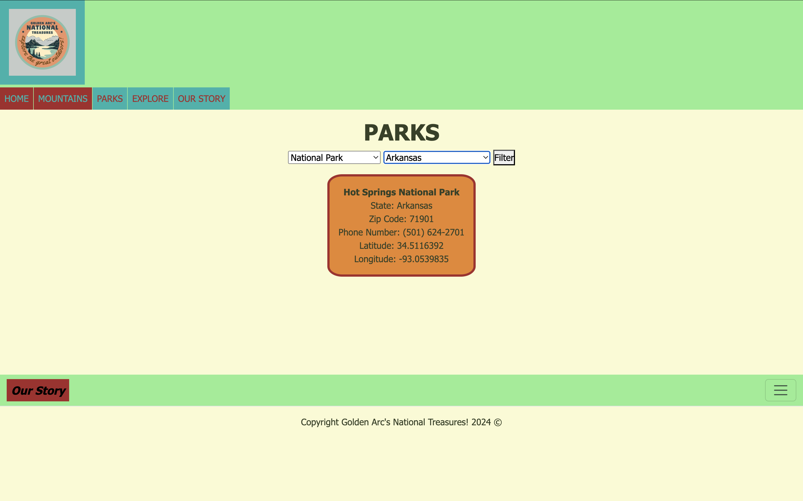

# "Golden Arc's National Treasures" 
Golden Arc's National Treasures is a family owned nature conservatory dedicated to the breathtaking landscapes of mountains and national parks across the country. From majestic mountains to serene park landscapes, it showcases the natural beauty and diversity of these treasured places.

## Homepage
- **Logo:** Showcases the business identity, the name. 
- **Mission:** Highights the two pages you can search and naviagte for mountains and parks. 
- **Photos:** 1. the mountain and 2. the park. 
- **Navigation:** Home, Mountains, Parks, Explore, Our Story
- **Footer:** Link to "Our Story" , "Contact Us", and "Activiities" as well as an ~ almost functional search bar.

## Mountains
- **Select a Mountain:** Submit and reveal the elevation, effort, coordinates, latitude, and longitude as well as a short bio on the information. 
- **Sunset-Sunrise:** Using API to pull the exact time of sunset and sunrise with the provided latitide and longitude. 

## Parks 
- **Select a Park Type:** data from Brightspace
- **Select a Park Location:** data from Brightspsce. 
- The filter will populate the correct outcome with the matching state, zipcode, phone number, latitude, and longitude.

## Explore
- **Photo Slideshow:** automatic slideshow showcasing the beauty of these national treasures. 
- **National Parks YT Video:** a short video showcasing the treaures of our parks here at Golden Arc's. 
- **Activities:** Yoga in the Woods, Things to Do, Glamping, and Drive-in Movies. Search bar. 

## Our Story 
- **Quick Bio:** The history behind the conservatory. "Since 1916, the McDowell family has dedicated their lives to preserving and celebrating America’s natural beauty through Golden Arc's National Treasures Nature Conservatory." Provides their roles, email address, and button to "contact" directly. 
- **Meet the Team:** Introducing the "McDowell family" and their roles in the company.
- **Contact Us:** Giving the hours of operation, phone number, and a form to submit to contact Golden Arcs directly.

